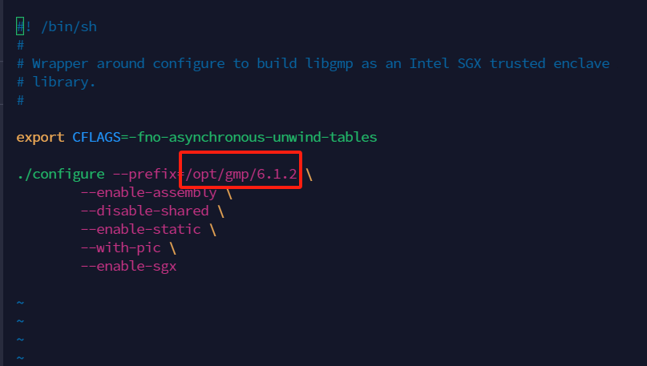
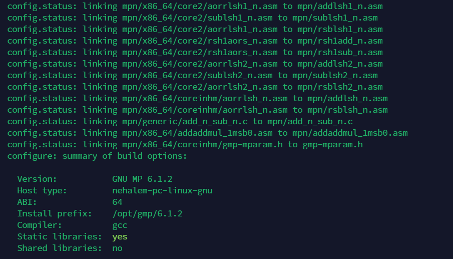
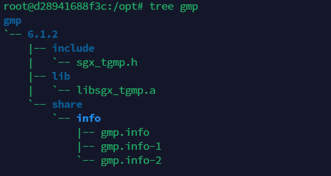
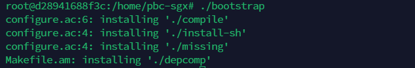

# SGX-enabled PBC library

### 一、Install SGX-GMP

```shell
git clone https://github.com/intel/sgx-gmp.git
cd sgx-gmp
```

Check file `sgx-configure` . It uses default settings. Modify the installation path as needed.



```shell
./sgx-configure
sudo make
sudo make install
```



Finally saved to path: `/opt/gmp/6.1.2/`



### 二、Install SGX-PBC

**Remark**: If the C++ version of the PBC library (located at `/usr/local/include/pbc`) was previously installed, rename it first (e.g., to `old-pbc`) to avoid naming conflicts with the sgx-pbc library to be downloaded.

```bash
git clone https://github.com/Aptx4869AC/sgx-pbc.git
export SGX_TSTDC_CPPFLAGS="-I/usr/local/include -I/usr/lib/x86_64-linux-gnu"
./bootstrap
```



```shell
./configure
make CFLAGS="-I/opt/gmp/6.1.2/include" CPPFLAGS="-I/opt/gmp/6.1.2/include"
sudo make install
```

After installation, the PBC library will be located at `/usr/local/include/pbc`. It is recommended to rename it to `sgx-pbc` (or another name) to avoid conflicts with the C++ source version of `pbc-0.5.14`.


## License

If you found this useful, I'd greatly appreciate a **Star ⭐** to show your support!  It helps others discover this project too. 

Copyright :copyright:2024 [Aptx4869AC](https://github.com/Aptx4869AC)
